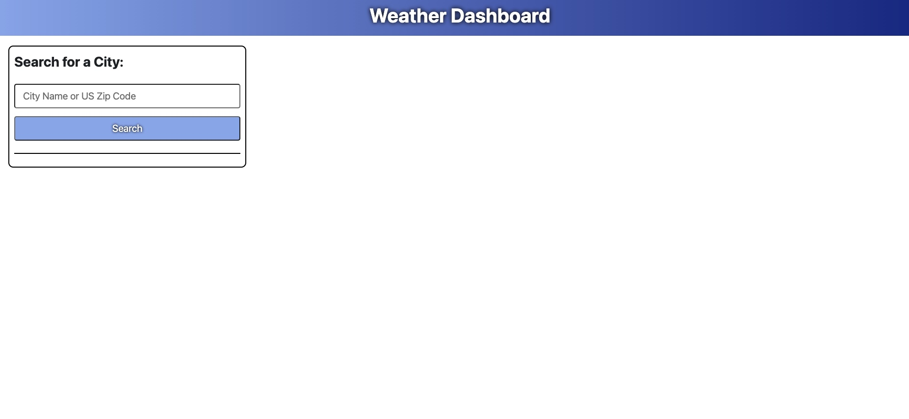
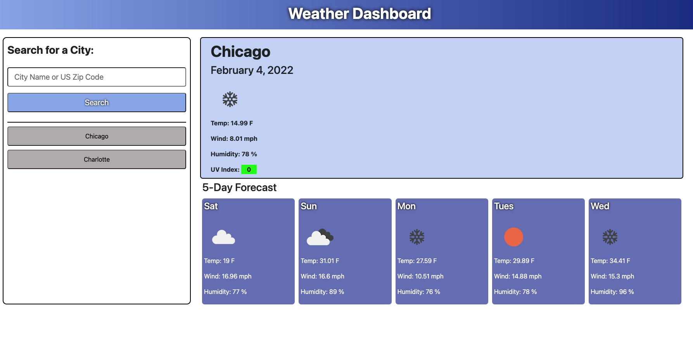

# Welcome to the Weather Dashboard

#### Weather Dashboard provides a quick snapshot of the weather in up to 10 cities across the US
---

#### Collaborators:
* [Brian Swartz](https://github.com/bdswartz)

<!-- ---

## Table of Contents -->
<!-- 
---

### The Problem:  
 
### The Solution:  
 -->

---

## User Story
### AS A traveler
    I WANT to see the weather outlook for multiple cities
    SO THAT I can plan a trip accordingly
    
### Acceptance Criteria for Minimum Viable Product

GIVEN a weather dashboard with form inputs

*  WHEN I search for a city 
        THEN I am presented with current and future conditions for that city and that city is added to the search history
*  WHEN I view current weather conditions for that city
        THEN I am presented with the city name, the date, an icon representation of weather conditions, the temperature, the humidity, the wind speed, and the UV index
*  WHEN I view the UV index
        THEN I am presented with a color that indicates whether the conditions are favorable, moderate, or severe
*  WHEN I view future weather conditions for that city
        THEN I am presented with a 5-day forecast that displays the date, an icon representation of weather conditions, the temperature, the wind speed, and the humidity
*  WHEN I click on a city in the search history
        THEN I am again presented with current and future conditions for that city
---

## API'S

* <b>Open Weather</b> - https://openweathermap.org/

---
## Technologies

> <b>Development Tools:</b>
  * JavaScript
  * CSS
  * HTML
  * Bootstrap
 
---

## Features And Functionality
Weather Dashboard is designed to be a quick and easy way to find the current weather conditions in a city and give the user a 5-day look ahead at the weather for that city. Features that are included in the Weather Dashboard include the following:
*  Ability to perform a more accurate search using a standard or extended US zip code as well as directly entering the city name.
*  Storage of city searches in the clients browser so that the user can draw on their search history for their next weather update.
*  Ability for the user to choose from the city search history list and initiate a new weather conditions request by clicking on that city in the list.
*  Refreshing the search history list every time a city is chosen to keep frequent user searches toward the top of the list.
*  Graphical representation of the current and forecast conditions in a city through use of dynamic icons based on current and forecast weather conditions.
*  Color coded graphical representation of the current ultraviolet index risk based on US EPA warning levels.

---
<!-- 
## Resource Links

  * <b>API access to Mobile Data:
  
--- -->
